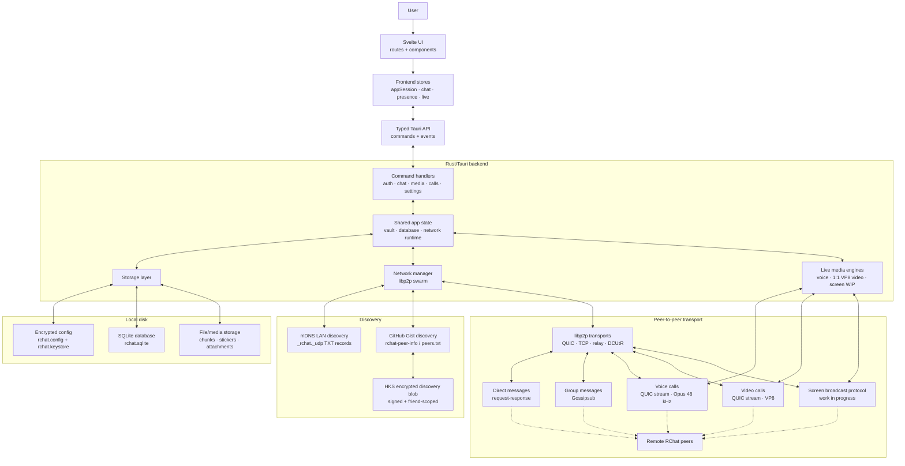

#  RChat

> Local-first, peer-to-peer messaging and live calling.

<p align="center">
  <video src="https://github.com/user-attachments/assets/773ef4b0-6813-45da-a266-b6b56b7e4140" width="100%" autoplay loop muted playsinline></video>
</p>

RChat is a desktop communication app built around one idea: your conversations should be local-first, direct when possible, and understandable when something goes wrong. It uses Tauri for the desktop shell, Svelte for the UI, Rust for storage/networking, SQLite for local message history, and libp2p for peer-to-peer transport.

RChat does not run a central chat server. Peers find each other through local-network mDNS and optional GitHub Gist discovery, then communicate over libp2p connections. Direct messages, group messages, temporary chats, file transfers, voice calls, video calls, and screen broadcasts are all coordinated from the local app.

For a visual showcase, visit [ata-sesli.github.io/rchat](https://ata-sesli.github.io/rchat/).

## What RChat Does

- **Direct chat** between trusted peers.
- **Self chat** for notes and local message storage.
- **Group chat** using libp2p Gossipsub.
- **Temporary chats** through short-lived invite links.
- **File and media messages** for images, documents, videos, audio, and stickers.
- **Voice calls** over a dedicated QUIC media stream using Opus at 48 kHz mono.
- **1:1 video calls** over a dedicated QUIC media stream using VP8.
- **Screen broadcast** protocol scaffolding. This remains work in progress.
- **Local peer discovery** with mDNS.
- **Remote peer discovery** with encrypted GitHub Gist publication.
- **Encrypted local configuration** protected by the vault password.
- **SQLite message history** stored locally on each device.

## Tech Stack

### Desktop and UI

- **Tauri 2** provides the desktop runtime and the Rust command bridge.
- **Svelte 5** renders the frontend.
- **Tailwind CSS 4** provides styling utilities.
- Frontend runtime state is organized into canonical stores:
  - `appSession`: auth, vault state, profile, connectivity, protected startup.
  - `chat`: active chat, messages, sidebar data, unread counts, envelopes.
  - `presence`: connected chat IDs and identity normalization.
  - `live`: voice/video/broadcast state and call availability.

### Backend

- **Rust** owns persistence, crypto, discovery, and networking.
- **SQLite** stores chats, messages, files, stickers, envelopes, and connection stats.
- **rvault-core** is used for vault-style encrypted configuration.
- **libp2p** provides peer identity, transport, request-response messaging, Gossipsub, relay support, Identify, Ping, Kademlia, and DCUtR.
- **zeroconf** provides native mDNS service advertisement and browsing.
- **octocrab** talks to GitHub Gists for remote discovery.
- **rubato** handles sample-rate conversion for voice capture/playback.
- **opus** encodes/decodes voice media.
- **RChat's local libvpx wrapper** encodes VP8 video media through system libvpx.

## High-Level Architecture



Arrows show the ownership and data flow inside one local RChat instance. Remote peers run the same stack. Discovery only provides addresses and encrypted invite/discovery metadata; message history stays local.

The frontend never talks directly to the database or network stack. It calls typed Tauri commands from `src/lib/tauri/api.ts` and listens to backend events such as message updates, presence changes, call state changes, and temporary-chat events.

The backend keeps long-running network state in a libp2p swarm task. UI commands are converted into network commands and sent to that task over channels.

## Local Storage and Vault

RChat has two important local storage layers:

1. **Encrypted configuration**
   - Stored in the app data directory as `rchat.config`.
   - Protected by a vault key from `rchat.keystore`.
   - Contains identity keys, encryption keys, friends, GitHub settings, pinned peers, connectivity settings, themes, and local profile data.

2. **SQLite database**
   - Stored under the platform data directory in `databases/rchat.sqlite`.
   - Contains local chat history, file metadata, stickers, envelopes, read/delivery status, and connection statistics.
   - Uses SQLite WAL mode and foreign keys.

The vault can be locked while the SQLite file still exists. That is expected: the database file is not enough for the app to become usable because the encrypted config contains the identities, keys, trusted peers, and settings needed to interpret and use the local state.

## Peer Identity

RChat uses several identity concepts:

- **libp2p PeerId** identifies a running peer on the P2P network.
- **Ed25519 identity key** signs published discovery data.
- **X25519 encryption key** is used with Hierarchical Key Sharing for friend-specific discovery payloads.
- **Chat IDs** identify UI conversations. Some direct chat IDs include scope prefixes, such as local-host or GitHub-derived IDs.

The frontend normalizes connected IDs so a raw libp2p PeerId and a scoped chat ID can still refer to the same person.

## Connectivity Modes

RChat exposes connectivity presets:

- **Invisible**
  - mDNS disabled.
  - GitHub sync disabled.
  - NAT keepalive disabled.
  - punch assist disabled.

- **LAN**
  - mDNS enabled.
  - GitHub sync disabled.
  - NAT keepalive disabled.
  - punch assist disabled.

- **Reachable**
  - mDNS enabled.
  - GitHub sync enabled.
  - NAT keepalive enabled.
  - punch assist enabled.

- **Custom**
  - Any non-preset combination of the underlying flags.

These settings control discovery and reachability. They do not change the local database.

## How mDNS Discovery Works

mDNS is the local-network discovery path. It is intended for peers on the same LAN, VM network, or local broadcast domain.

When networking starts and mDNS is enabled:

1. RChat starts a native zeroconf service for `_rchat._udp`.
2. The service advertises the local libp2p PeerId as the service instance identity.
3. The TXT record includes:
   - `peer_id`
   - `version`
   - `protocol`
   - optional user `alias`
4. The advertised port is the libp2p QUIC UDP port.
5. RChat also browses for `_rchat._udp` services.
6. When another RChat service is found, RChat reads the TXT record and skips itself if the discovered `peer_id` matches the local peer.
7. It builds a libp2p QUIC multiaddr:

```text
/ip4/<discovered-ip>/udp/<port>/quic-v1
```

8. That discovered peer is sent into the network manager and exposed to the UI as a local peer.

The browser loop periodically re-queries mDNS:

- normally every 30 seconds,
- every 5 seconds when fast discovery is enabled, such as when the Add Person flow is active.

If mDNS returns `0.0.0.0`, RChat attempts to resolve the advertised hostname and replace it with a concrete IPv4 address. This helps on platforms where the mDNS event does not include a directly usable address.

mDNS is fast and local, but it does not cross most routers or the public internet. That is why RChat also has GitHub Gist discovery.

## How GitHub Gist Discovery Works

GitHub Gist discovery is the remote discovery path. It lets trusted peers publish reachable libp2p addresses without RChat running a central server.

Each GitHub-connected user has, or can create, a public Gist with:

- description: `rchat-peer-info`
- file name: `peers.txt`

Although the Gist is public, the useful discovery payload is not published as plain text for everyone. RChat creates a compressed Base64 blob containing HKS-protected data.

### Publishing

When GitHub sync is enabled, RChat publishes the local reachable addresses:

1. Load local config from the unlocked vault.
2. Read the local Ed25519 signing key and X25519 encryption key.
3. Build a Hierarchical Key Sharing tree from trusted friends and their X25519 public keys.
4. Put the current libp2p listening addresses into the payload.
5. Sign and encrypt/export the HKS blob.
6. Inject any short-lived pending invitations into the blob.
7. Compress and Base64-encode the blob.
8. Find an existing `rchat-peer-info` Gist or create one.
9. Write the blob to `peers.txt`.

This means GitHub stores a discovery envelope, not the local database or message history.

### Fetching

Every discovery interval, RChat can poll known friends:

1. Load trusted friends from local config.
2. For each friend, find that user’s `rchat-peer-info` Gist.
3. Download `peers.txt`.
4. Decode and decompress the blob.
5. Verify the friend’s Ed25519 signature.
6. Use the local X25519 secret to decrypt the part intended for this user.
7. Parse each line as a libp2p multiaddr.
8. Send those addresses into the network manager for dialing.

Only friends with the required key material can decrypt the useful address payload.

### Invitations and Shadow Invites

The same Gist blob can carry short-lived invitation data:

- invitations expire after 120 seconds,
- shadow invites also expire after 120 seconds,
- expired entries are filtered before use and cleaned during publication.

This supports invite and connection flows without introducing a central RChat service.

## Networking Internals

RChat builds a libp2p swarm with:

- **TCP + Noise + Yamux**
- **QUIC**
- **Relay client**
- **DCUtR** for direct connection upgrade through relay
- **Identify** for connection metadata
- **Ping** for connection health
- **Kademlia** with an in-memory store
- **Gossipsub** for group messages
- **request-response** protocols for direct messages and broadcast frames
- custom stream behaviours for long-lived voice and video media streams

The app listens on IPv4 and IPv6 TCP and QUIC addresses. Voice calls require a QUIC path because low-latency media is sensitive to transport behavior.

## Messaging Model

### Direct Messages

Direct messages use a libp2p request-response protocol:

```text
/rchat/dm/1.0.0
```

The sender stores an optimistic local message, sends the request, and updates delivery/read status as responses and events arrive.

### Group Messages

Group messages use libp2p Gossipsub. Group chat topics are subscribed when the network manager starts or when group chat commands require them. Messages are signed by the libp2p identity used by Gossipsub.

### Temporary Chats

Temporary chats live in runtime state rather than as normal trusted friends. They are created through invite links, can be promoted or archived, and can expire/end independently from the normal friend list.

## Files, Media, and Stickers

The SQLite database tracks file metadata and chunks:

- `files`
- `file_chunks`
- `stickers`
- `messages` with `content_type` and `file_hash`

The UI supports sending and receiving images, documents, videos, audio clips, and stickers. Message rows point to file hashes, while the backend handles file storage and retrieval.

## Voice Calls

Voice calls use the live voice subsystem:

- capture/playback through CPAL,
- resampling through Rubato,
- Opus codec through the `opus` crate,
- 48 kHz mono audio,
- 20 ms Opus frames, 960 samples per frame,
- target bitrate around 32 kbps,
- dedicated libp2p voice stream protocol:

```text
/rchat/call/audio/1.0.0
```

The voice stream is long-lived for the duration of a call. It writes a call header once and then sends ordered media frames with:

- sequence number,
- timestamp,
- opaque Opus payload.

The receiver decodes Opus packets back to PCM and feeds a playback queue. The voice engine records diagnostics such as generated frames, underruns, dropped samples, queue depth, Opus errors, and transport frame counts.

## Video Calls and Screen Broadcasts

1:1 video calls are being implemented on the same live-call model as voice:

- Rust owns native camera capture through RChat's local `rchat-video-capture` crate,
- Rust owns VP8 encoding through RChat's local `libvpx` wrapper,
- the WebView owns remote VP8 decode/rendering and the local preview surface,
- video media uses a long-lived libp2p QUIC stream:

```text
/rchat/call/video/1.0.0
```

The video stream carries ordered records for VP8 frames, receiver reports, camera state, and quality changes. Auto quality starts at `720p30` and can shift between `720p30`, `480p30`, and `360p30` based on encode/render pressure. Video calls reuse the existing Opus voice path for audio, and a one-sided camera session is valid.

Screen broadcasts are still work in progress. They remain separate from the 1:1 video-call path and still depend on browser/WebView screen-capture APIs.

The UI asks the backend whether native camera capture is available and separately checks whether the WebView can decode/render remote VP8. Unsupported incoming video or broadcast sessions are rejected automatically.

## Frontend State Structure

The frontend is intentionally store-driven:

- `src/lib/stores/appSession.ts`
  - owns auth status, vault lock state, profile, connectivity, and protected startup.

- `src/lib/stores/chat.ts`
  - owns chat list, active chat, current messages, unread counts, envelopes, local peer discoveries, message-status races, and optimistic sends.

- `src/lib/stores/presence.ts`
  - owns connected chat IDs and normalization between raw PeerIds and scoped chat IDs.

- `src/lib/stores/live.ts`
  - owns voice/video/broadcast state, support detection, call actions, and future diagnostics shape.

Routes consume stores. They should not each independently subscribe to backend events for the same data.

## Important Source Paths

- `src/routes/+layout.svelte` - app shell, auth-gated rendering, modals.
- `src/routes/chat/[id]/+page.svelte` - active chat page.
- `src/components/chat/ChatArea.svelte` - chat UI, media attachment UI, live call UI.
- `src/lib/tauri/api.ts` - typed frontend command wrapper.
- `src/lib/stores/` - frontend canonical stores.
- `src-tauri/src/storage/` - encrypted config, SQLite, theme storage.
- `src-tauri/src/network/` - libp2p swarm, discovery, mDNS, Gist sync, direct messaging.
- `src-tauri/src/live/voice/` - voice capture, resampling, Opus, jitter/playback, stream protocol.
- `src-tauri/src/live/video/` - video call protocol and manager.
- `src-tauri/src/live/broadcast/` - screen broadcast protocol and manager.
- `src-tauri/crates/rchat-video-capture/` - native camera capture and YUV/I420 conversion.
- `src-tauri/src/commands/` - Tauri commands exposed to the frontend.

## Development

### Fedora/RHEL Source Build

Install native build dependencies first:

```bash
scripts/dist/install-fedora-build-deps.sh
```

Then install the JavaScript dependencies and run RChat:

```bash
bun install
bun run tauri dev
```

For a release-style local build:

```bash
bun run tauri build
```

The Fedora helper installs native libraries and compilers only. If `cargo`, `rustc`, or `bun` are missing, install Rust with `rustup` and Bun from the official Bun installer before building.

Install JavaScript dependencies:

```bash
bun install
```

Run the frontend/Tauri development flow:

```bash
bun run tauri dev
```

Run frontend checks:

```bash
bun run check
```

Run Rust tests:

```bash
cargo test --manifest-path src-tauri/Cargo.toml
```

Run focused call-validation tests:

```bash
cargo test --manifest-path src-tauri/Cargo.toml call_validation
```

## Native Dependencies

RChat uses native desktop, audio, video, and networking libraries through Rust crates and Tauri. On Linux, make sure the system has the runtime/build dependencies needed by Tauri, PipeWire/ALSA, Opus, and libvpx. The package scripts and dependency docs in this repository track the exact packaging requirements.

Notable native pieces:

- `opus` links to native libopus through Rust bindings.
- RChat's local `rchat-libvpx` crate links to native libvpx for VP8 video encoding.
- RChat's local `rchat-video-capture` crate uses Nokhwa over AVFoundation on macOS and V4L2 on Linux for camera capture.
- `cpal` talks to platform audio backends.
- `zeroconf` uses platform mDNS/Bonjour/Avahi-style functionality.
- Tauri requires the usual platform WebView dependencies.

## Security Notes

- RChat does not upload message history to GitHub.
- GitHub Gists are used only for discovery/invite metadata.
- Discovery payloads intended for friends are signed and encrypted through the local key material and HKS.
- The local encrypted config is required to use identities and trusted peer state.
- SQLite stores local app data and message history on the device.

## Current Design Tradeoffs

- There is no central RChat server, so reachability depends on local networks, GitHub discovery, relays, NAT behavior, and connectivity settings.
- mDNS is excellent on LANs but does not cross most network boundaries.
- GitHub Gist discovery depends on GitHub availability and configured friend keys.
- Voice/video quality depends on OS audio/video backends in addition to RChat’s transport and codecs.
- Each peer keeps its own local database; message history is not globally reconciled by a server.
